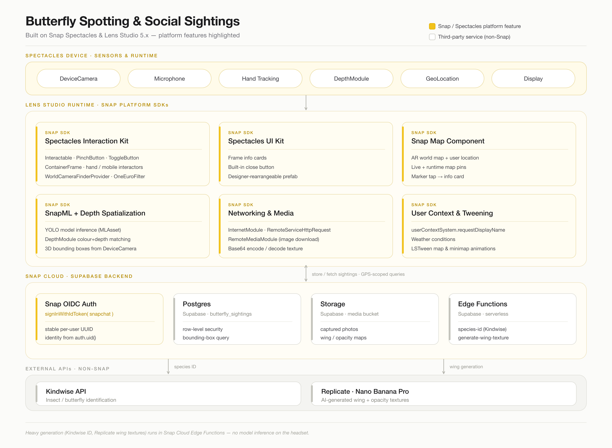

# The Butterfly Path

**An AI-guided butterfly discovery experience for Snap Spectacles.** Spot a butterfly in the wild and Spectacles identifies it, teaches you about it through an AI naturalist, and grows it into your own AR collection, completely hands-free.

Built by Team Banana for the AWE 2026 Reality Hack.

---

## What it is

Nature is a treasure trove of discovery, but two groups keep hitting friction: naturalists and researchers need efficient ways to identify and document species in the field, and learners and educators want more engaging ways to explore local biodiversity. The Butterfly Path addresses both, through the example of butterflies, by simplifying ecological observation and turning butterfly discovery into an interactive, gamified learning experience.

We interviewed naturalists and researchers and kept hearing the same thing: real curiosity starts with close, first-hand observation paired with a story that pulls you in. The whole experience is designed around that insight.

## The discovery loop

**Noticing → Identifying → Recording → Sharing → Collecting**, all driven by voice and your gaze.

1. **Noticing.** A Gemini Live voice agent runs the experience hands-free. Raise an open palm toward your face and pinch to talk. A *Naturalist* agent guides you to slow down and observe through Socratic questions, and can scan the camera view to flag butterflies it finds.
2. **Identifying.** The agent identifies the species, spawns a 3D info card with species data, photos, and a conservation-status indicator, and an *Archivist* agent shares facts and stories. AI wing generation creates a bespoke wing texture for a live 3D butterfly that flutters into your space.
3. **Recording.** Each sighting (species data, photos, GPS) is persisted to the cloud and attributed to you.
4. **Sharing.** A floating AR minimap pins real-world sightings around you, including ones logged by other players, in a shared and persistent sighting world.
5. **Collecting.** Identified butterflies fly in and perch on your index finger, joining a personal collection you can revisit any time, each rendered as its own AI-generated 3D butterfly.

## Key features

- **Multi-agent AI education system** with LLM-based routing and two collaborating personas (Naturalist + Archivist)
- **Palm-up push-to-talk** voice interaction via SIK hand tracking
- **On-device butterfly detection** (SnapML / YOLO) that auto-chains into species identification
- **AI-generated wing textures** (Replicate + Nano Banana Pro) applied to live 3D butterflies
- **Cloud-persistent, shared sighting world** with real geospatial "near me" queries
- **AR world map** with directional quest markers and a custom collision solver for legibility
- **Educational info cards** with conservation status and flight-season visualizations
- **Butterflies that land on your finger** and a personal AR collection gallery

## Built with

- **Snap Spectacles + Lens Studio 5.x** (TypeScript)
- **Gemini Live** (`gemini-2.0-flash-live-preview-04-09`) via Remote Service Gateway, with OpenAI Realtime as a fallback voice provider
- **Supabase on Snap Cloud**: Postgres (with row-level security), Storage, and Edge Functions for serverless species ID and wing generation
- **Snap OIDC** authentication (`signInWithIdToken({ provider: "snapchat" })`)
- **Kindwise insect-ID API** for species identification
- **Replicate + Nano Banana Pro** for wing texture + opacity map generation
- **Spectacles Interaction Kit (SIK)** and **Spectacles UI Kit**
- **Snap Map Component** for the AR world map
- **SnapML / YOLO** for on-device butterfly detection

A full feature-to-platform breakdown lives in the project writeup.

## Repository structure

The project is a Lens Studio project under [`TeamBanana/`](TeamBanana/). Each team member works in their own `Assets/_Name/` folder to minimise merge conflicts:

| Folder | Area |
|---|---|
| `Assets/_Boon/` | Supabase DB, butterfly info display, wing generator, AR map, butterfly flight |
| `Assets/_Niko/` | ML object detection pipeline, butterfly collection UI |
| `Assets/_Aggy/` | Butterfly detection + Kindwise identification, palm push-to-talk |
| `Assets/_Joe/` | Gemini Live, multi-agent system, image/model generation, chat UI |
| `Assets/_UtilityScripts/` | Shared utility components |

See [`MAP.md`](MAP.md) for a complete module-by-module map of every script, its inspector inputs, public API, and dependencies.

## Getting started

**Prerequisites**

- Lens Studio 5.x
- Snap Spectacles (2024) for on-device features (hand tracking, camera, and identification do not run in Lens Studio Preview)
- A **Remote Service Gateway** token (Lens Studio Asset Library) for Gemini / OpenAI access
- A **Supabase on Snap Cloud** project with the `butterfly_sightings` table, Storage bucket, and Edge Functions deployed

**Run it**

1. Clone the repo (uses Git LFS for assets, so clone rather than downloading a zip).
2. Open `TeamBanana/` in Lens Studio 5.x.
3. Set the Preview device type to **Spectacles (2024)**.
4. Add your Remote Service Gateway token and Supabase credentials to the scene.
5. Push to a paired Spectacles device to try the full experience.

---

## AI/LLM Instructions

If you are an AI agent or LLM working in this repository:

- Always check `agentic-tools/` for Lens Studio-specific skills, workflows, and agent tools.
- Always check `context/` for Lens Studio-specific project context, constraints, and references.
- Read `MAP.md` before making changes, and update your own section after changing scripts.
- Use those folders as the primary source of truth for Lens Studio-related tasks in this repo.
